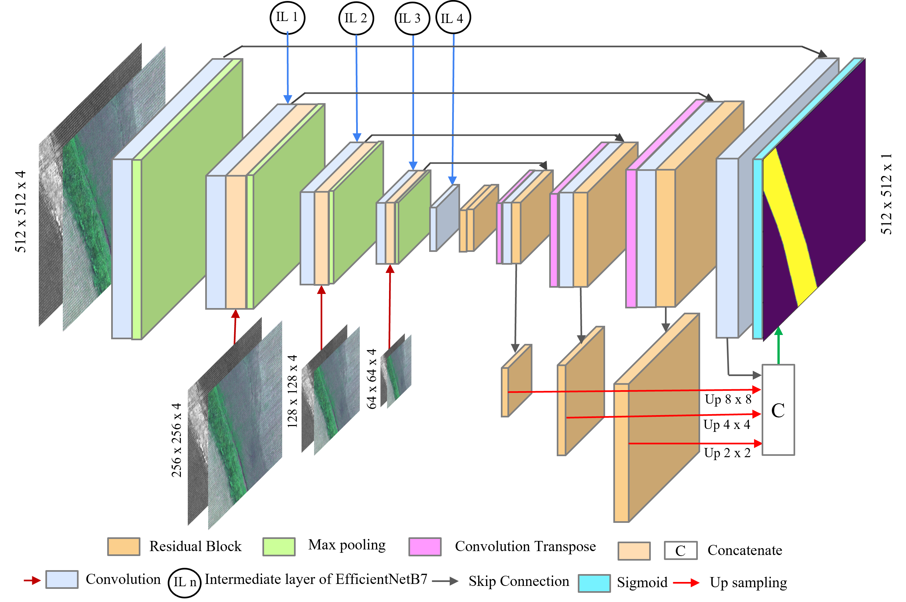

# Paper Accepted at Computer Vision and Image Provessing (CVIP-2021) Conferance 

# Proposed Ms-Net Architecture

Dataset taken from Computer Vision for Agriculture challenge
# Link for Agriculture-Vision Dataset

Link: https://www.agriculture-vision.com/agriculture-vision-2020/dataset

# Codalab challange 

Link: https://competitions.codalab.org/competitions/23732?secret_key=dba10d3a-a676-4c44-9acf-b45dc92c5fcf 

# Requirement

Tensorflow 2.0.0
